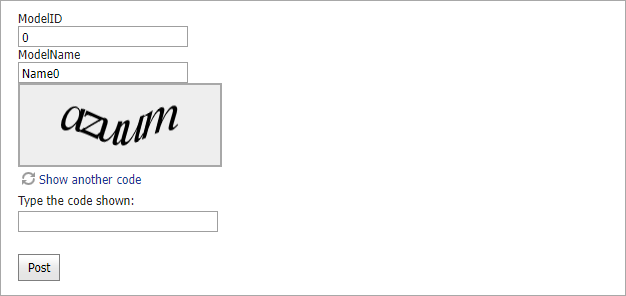

<!-- default badges list -->

<!-- default badges end -->
# Data Editors for ASP.NET MVC - How to use AJAX callbacks to validate a Captcha code and submit a form

This example demonstrates how to use callbacks to validate model data and [Captcha](https://docs.devexpress.com/AspNetMvc/15164/components/data-editors-extensions/captcha) code.

Call the jQuery library's [serialize](https://api.jquery.com/serialize/) method to collect values from all editors displayed in a form. Send these values in an AJAX callback to the Controller.

## Files to Review

* [Index.cshtml](./CS/AjaxSupport/Views/Home/Index.cshtml)
* [Index2.cshtml](./CS/AjaxSupport/Views/Home/Index2.cshtml)
* [HomeController.cs](./CS/AjaxSupport/Controllers/HomeController.cs) (VB: [HomeController.vb](./VB/AjaxSupport/Controllers/HomeController.vb))
* [MyModel.cs](./CS/AjaxSupport/Models/MyModel.cs) (VB: [MyModel.vb](./VB/AjaxSupport/Models/MyModel.vb))
* [_CaptchaPartial.cshtml](./CS/AjaxSupport/Views/Home/_CaptchaPartial.cshtml)
* [EditFormPartial.cshtml](./CS/AjaxSupport/Views/Home/EditFormPartial.cshtml)
